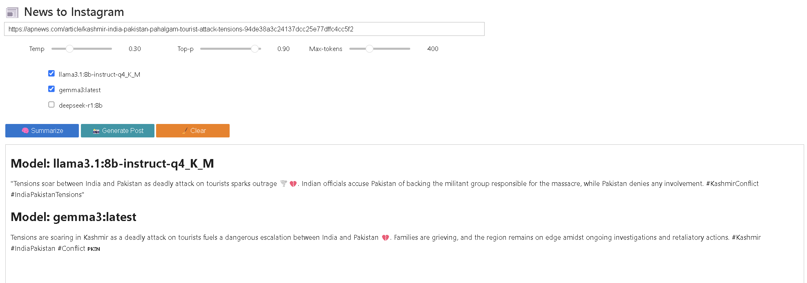

# 🎩 LLM Web Summarizer

> Your pocket newsroom: fetch, summarize, and spin news articles into scroll-stopping Instagram captions powered by local LLM magic! ✨



---

## 🎯 Project Goal

Transform any public news URL into two ready-to-share deliverables in one click:
1. **Balanced 5–7 sentence summary** under a “senior news editor” prompt  
2. **Punchy 2–3 sentence Instagram caption** with context-aware emojis & hashtags  

All while comparing multiple Ollama LLMs side-by-side.

---

## 🚀 Key Features

- **🕵️‍♂️ Stealthy Scraper**  
  Undetected Selenium → strips ads, modals & cookie banners → HTTP fallback → caching  
- **✍️ Journalist-Grade Summaries**  
  No more “text too short” apologies—just crisp, balanced overviews  
- **📸 Insta-Alchemist**  
  Converts summaries into engaging captions: emojis, hashtags, and brand-safe flair  
- **⚡ Parallel Model Arena**  
  Spin up llama3.x, gemma3, deepseek-r1 (and friends) in threads with live progress bars  
- **🎨 Customizable Voice**  
  Drop your own `soft_prompt.txt` to dial in any tone—from “hard-news anchor” to “travel blogger”

---

## 🧠 How It Works

```python
# 1. fetch_article(url)
#    • Try headless Chrome → remove overlays → fallback to requests
#    • Return (title, full_text)

# 2. summarize(text)
#    • System prompt: “You’re a senior news editor…”
#    • 5–7 sentence balanced summary

# 3. build_instagram_post(summary)
#    • System prompt: “You are a social media strategist…”
#    • 2–3 sentence caption with emojis & hashtags

# 4. parallel_llm(func, text, models)
#    • ThreadPoolExecutor + ipywidgets progress → stream each model’s output
```

---

## 🎨 Tech Stack

- **Python 3.8+**  
- **Jupyter Notebook** + **ipywidgets**  
- **undetected_chromedriver** & **Selenium**  
- **BeautifulSoup** for parsing  
- **Ollama** local LLM API  
- **ThreadPoolExecutor** for parallelism  

---

## ⚙️ Installation & Usage

1. **Clone & Install**  
   ```bash
   git clone https://github.com/yourusername/LLM_Web_Summarizer.git
   cd LLM_Web_Summarizer
   pip install -r requirements.txt
   ```  
2. **(Optional) Customize Your Voice**  
   ```bash
   echo "You’re a globe-trotting editor with a knack for storytelling…" > soft_prompt.txt
   ```  
3. **Launch the Notebook**  
   ```bash
   jupyter notebook News_to_Instagram.ipynb
   ```  
4. **Paste, Slide & Click**  
   - Paste any article URL  
   - Tweak Temperature, Top-p & Max-Tokens  
   - Select your favorite models  
   - Click **🧠 Summarize** or **📸 Generate Post**  
   - Copy & wow your audience!

---

